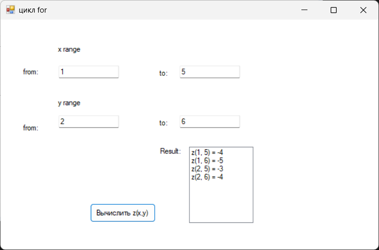

# Лабораторная работа 5

### Описание задания:
Создайте приложение Windows Forms Application для
расчета значения функции z(x,y) = x - y. Диапазон значений
для x и y вводятся в текстовые поля.

---
### Интерфейс главной формы (Lab5.cs)

Название проекта: `Lab5`, название файла формы `Цикл for`

---

### Инструментарий

| Объект              | Свойство `Name` | Свойство `Text`     |
|---------------------|-----------------|---------------------|
| **Форма**           | `Lab5`    		 | Цикл for            |
| **Кнопка**          | `btnCalc`       | Вычислить z(x,y)    |
| **Текстовое поле**  | `txtX1`         | 1              	  |
| **Текстовое поле**  | `txtX2`         | 5              	  |
| **Текстовое поле**  | `txtY1`         | 2              	  |
| **Текстовое поле**  | `txtY2`         | 6              	  |
| **Cписок**  		 	 | `lstResult`     |                     |
---
